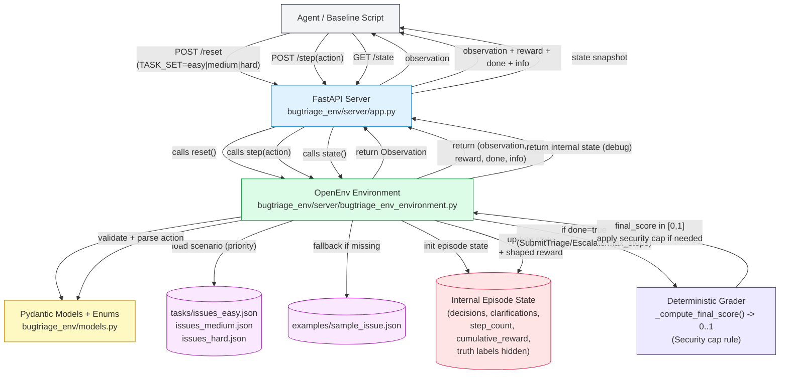

# Architecture Overview

This document provides a high-level overview of the **Bug/Issue Triage OpenEnv** architecture, detailing the interactions between the agent, the server layer, and the core environment logic.

## System Workflow

The following diagram illustrates the flow of a typical triage episode, from initialization to terminal scoring.

## Component Breakdown

### 1. Agent Layer
The agent interacts with the environment via a RESTful API provided by the FastAPI server. It submits triage actions and receives observations.

### 2. Server Layer (`app.py`)
A lightweight FastAPI wrapper that exposes the environment endpoints (`/reset`, `/step`, `/state`). It ensures that the agent's requests are correctly routed to the core logic.

### 3. Environment Core (`bugtriage_env_environment.py`)
Responsible for managing the lifecycle of an episode. It handles state transitions, action validation using Pydantic models, and interfaces with the grading logic.

### 4. Grading Logic
A deterministic grader ensures fair and consistent evaluation of agent performance. It incorporates security rules (e.g., security caps) to penalize dangerous triage decisions.
